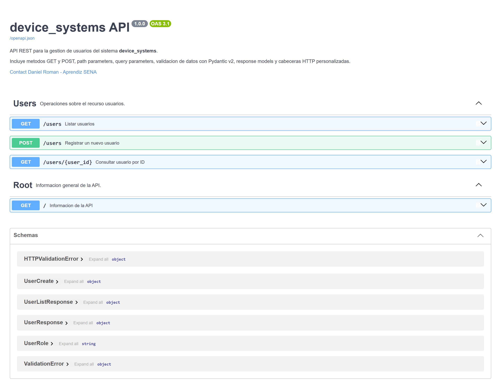
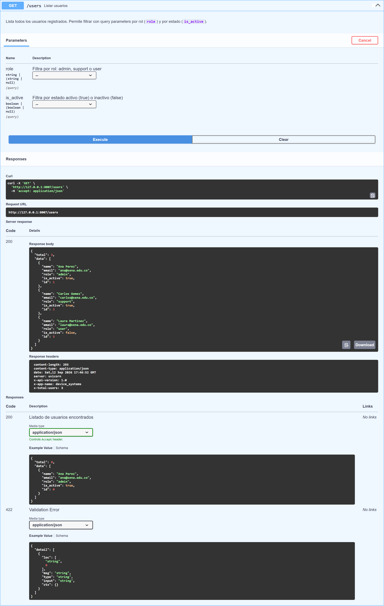
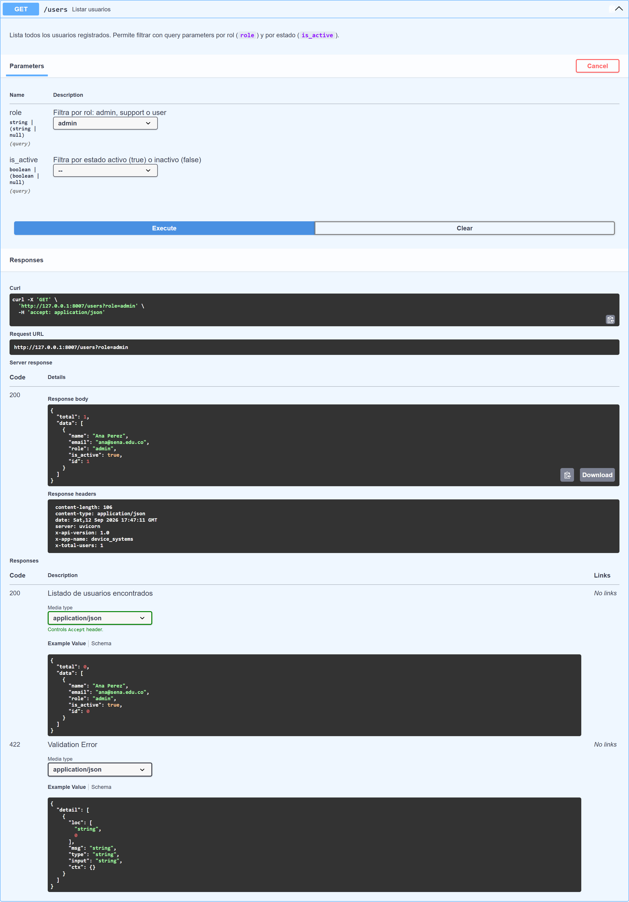
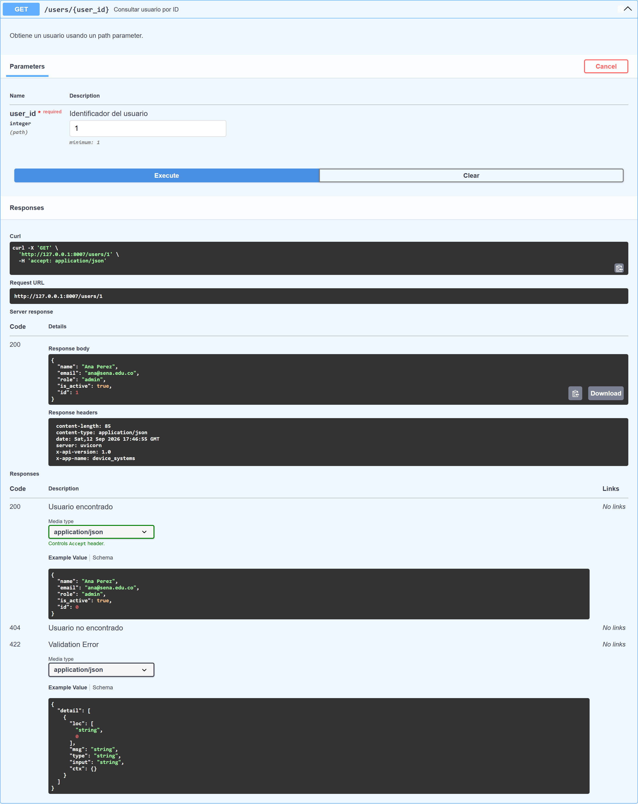
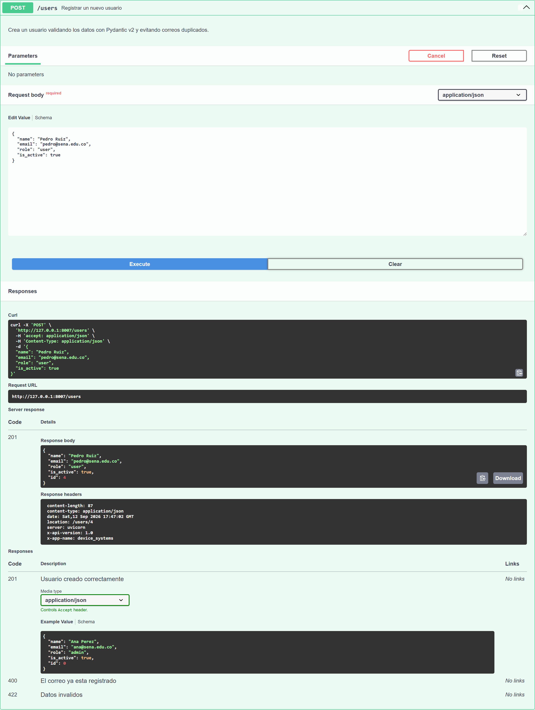
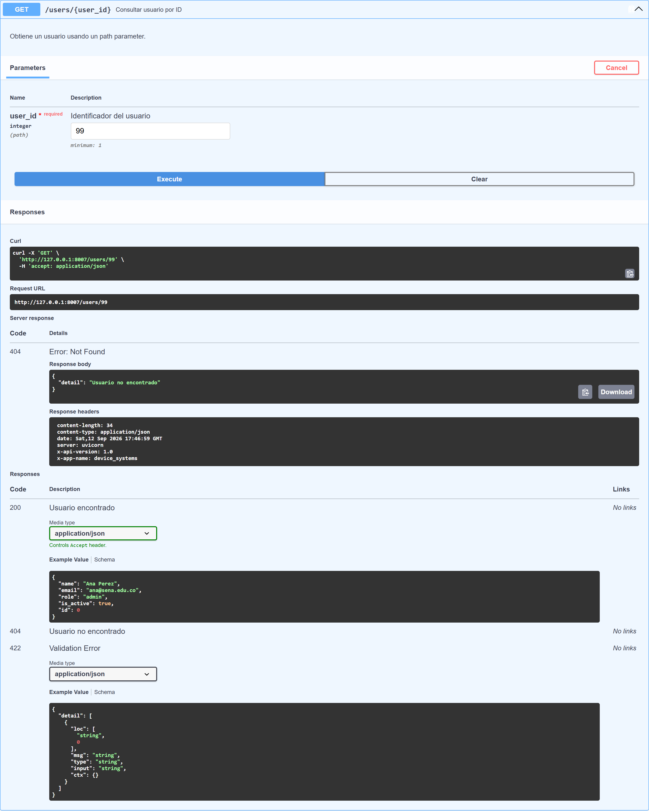
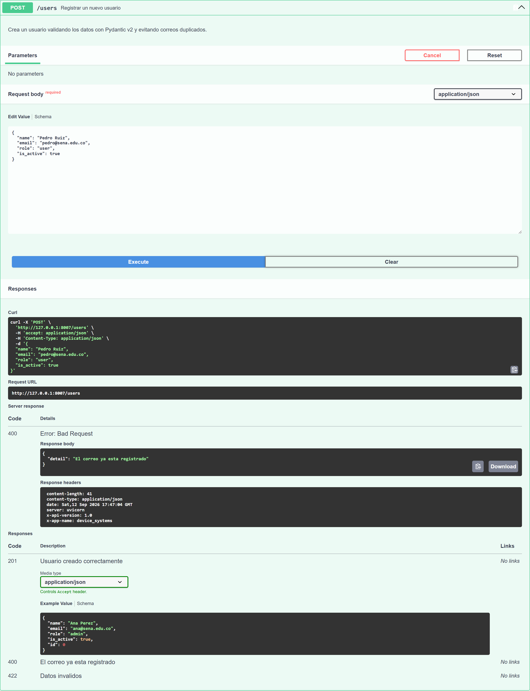
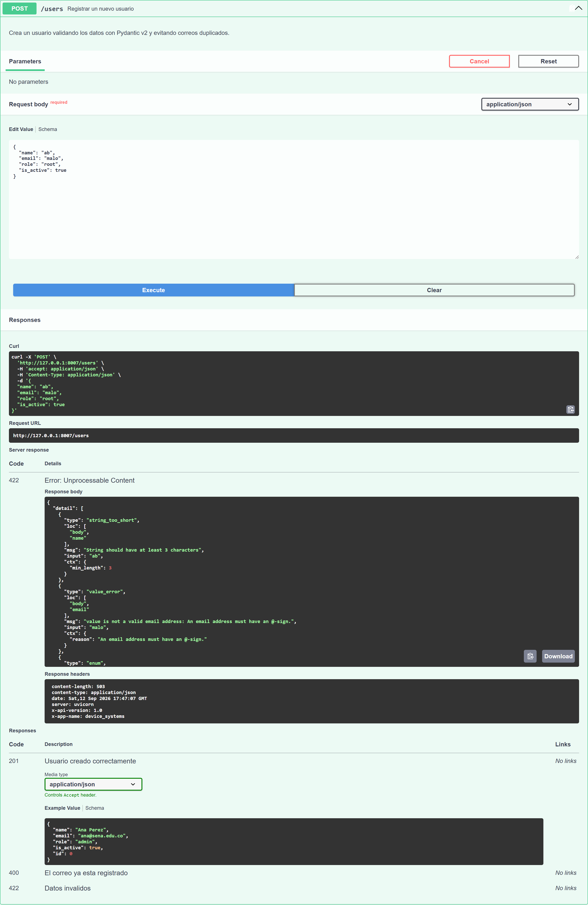

# Evidencias EV07 — Fundamentos de FastAPI

**Guia:** GA1-220501096-01-AA1-EV07
**Aprendiz:** Daniel Roman
**Proyecto:** `device_systems` (v1.0.0) — codigo en `../device_systems/`
**Repositorio:** https://github.com/daniel-roman345/python-avanzado-

---

## 1. Capturas de Swagger UI

Documentacion automatica generada por FastAPI en `/docs`, con los metadatos de la API
(titulo, descripcion, version, contacto) y los endpoints agrupados por tags.

## 2. Evidencia de pruebas `GET /users`

Listado completo de usuarios. En la respuesta se observan el `total`, el arreglo `data`
y las **cabeceras personalizadas** `x-app-name`, `x-api-version` y `x-total-users`.

### Filtro por query parameter `role=admin`

## 3. Evidencia de pruebas `GET /users/{user_id}`

Consulta por **path parameter**; devuelve `200 OK` con el usuario solicitado.

## 4. Evidencia de pruebas `POST /users`

Registro de un usuario nuevo: responde `201 Created`, devuelve el usuario con su `id`
y agrega la cabecera `location`.

## 5. Evidencia de validaciones y errores

### 5.1 Usuario no encontrado — `404 Not Found`

### 5.2 Correo duplicado — `400 Bad Request`

### 5.3 Datos invalidos (Pydantic v2) — `422 Unprocessable Entity`

Se envio `{"name": "ab", "email": "malo", "role": "root"}` y Pydantic reporto los tres
errores: nombre corto, correo sin formato valido y rol fuera de los permitidos.

## 6. Resumen de pruebas

| # | Prueba | Esperado | Resultado |
|---|---|---|---|
| 1 | `GET /users` | `200` + 3 usuarios | OK |
| 2 | `GET /users?role=admin` | `200` + 1 usuario | OK |
| 3 | `GET /users?is_active=false` | `200` + 1 usuario | OK |
| 4 | `GET /users/1` | `200` | OK |
| 5 | `GET /users/99` | `404` | OK |
| 6 | `POST /users` valido | `201` | OK |
| 7 | `POST /users` correo repetido | `400` | OK |
| 8 | `POST /users` datos invalidos | `422` | OK |
| 9 | Cabeceras `X-App-Name` / `X-API-Version` | Presentes | OK |

## 7. Reflexion sobre el uso de FastAPI para construir APIs REST

Construir esta API me mostro que FastAPI resuelve con muy poco codigo tareas que
normalmente son repetitivas. Al declarar los tipos en la firma de la funcion, el
framework lee el path parameter, convierte el query parameter a `bool` o a `Enum`,
valida el cuerpo de la peticion y devuelve un `422` con el detalle exacto del error,
sin escribir validaciones manuales.

Pydantic v2 es la pieza central: separar `UserCreate` de `UserResponse` permite
controlar que entra y que sale de la API. Ademas, los `response_model` alimentan la
documentacion OpenAPI, de modo que Swagger UI sirve para probar y no solo para leer.

Por ultimo, el middleware de cabeceras `X-App-Name` y `X-API-Version` me mostro como
interceptar todas las peticiones en un solo punto, algo clave para trazabilidad y
versionado en las siguientes versiones de `device_systems`.
