# Evidencias EV09 — FastAPI con SQLAlchemy (persistencia de datos)

**Guia:** GA1-220501096-01-AA1-EV09
**Aprendiz:** Daniel Roman
**Proyecto:** `device_systems` (v3.0.0) — codigo en `../device_systems/`
**Repositorio:** https://github.com/daniel-roman345/python-avanzado-

---

## 1. Estructura del proyecto

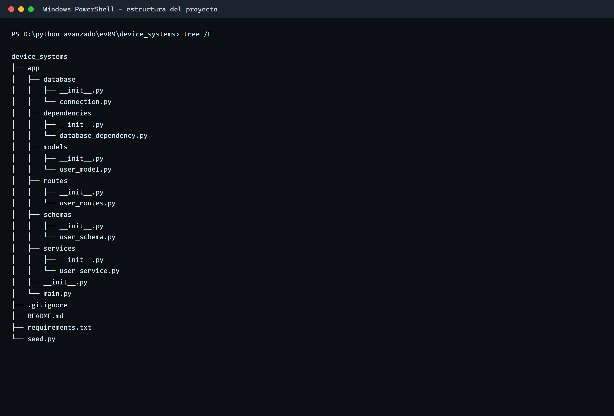

## 2. Base de datos generada

Tabla `users` creada por SQLAlchemy en `device_systems.db`, con sus constraints
(`NOT NULL`, `PRIMARY KEY`), sus indices (`ix_users_email`, `ix_users_id`) y los
registros almacenados.

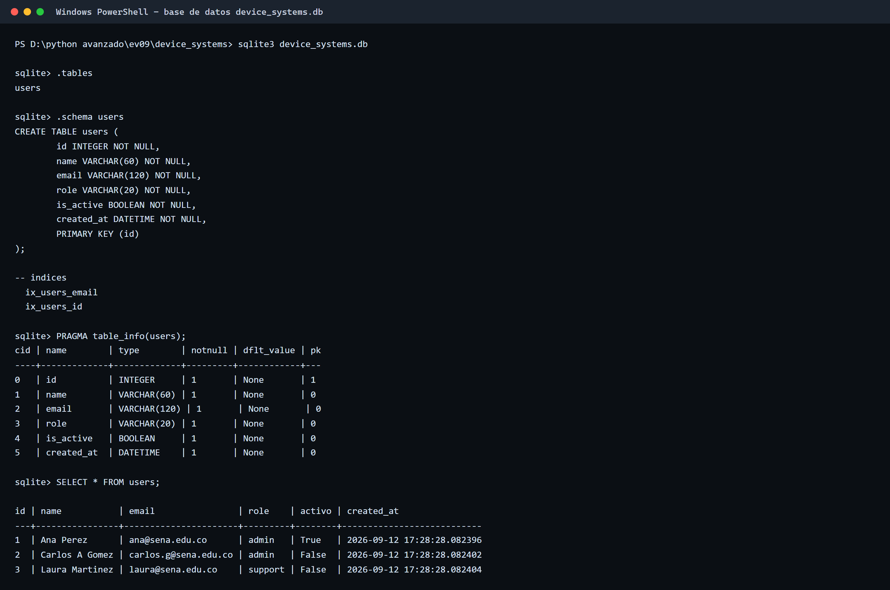

## 3. Capturas de Swagger UI

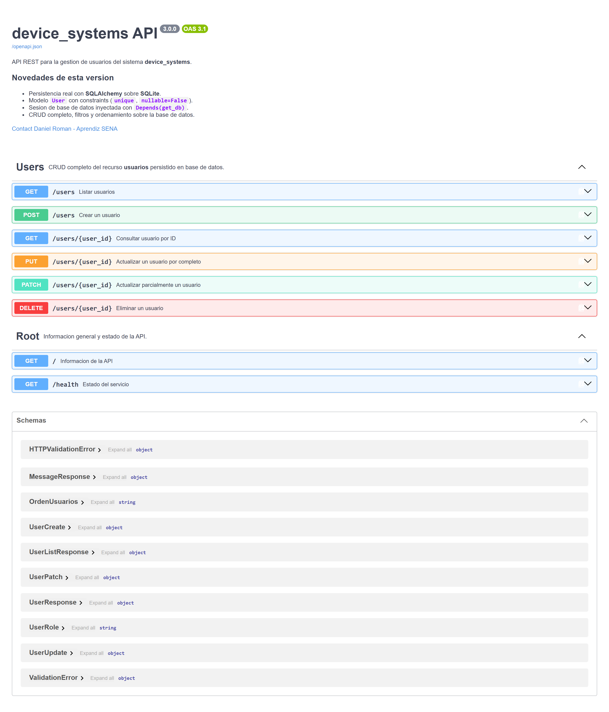

## 4. Evidencia de prueba de cada endpoint

### 4.1 `POST /users` — crear usuario en base de datos (`201`)

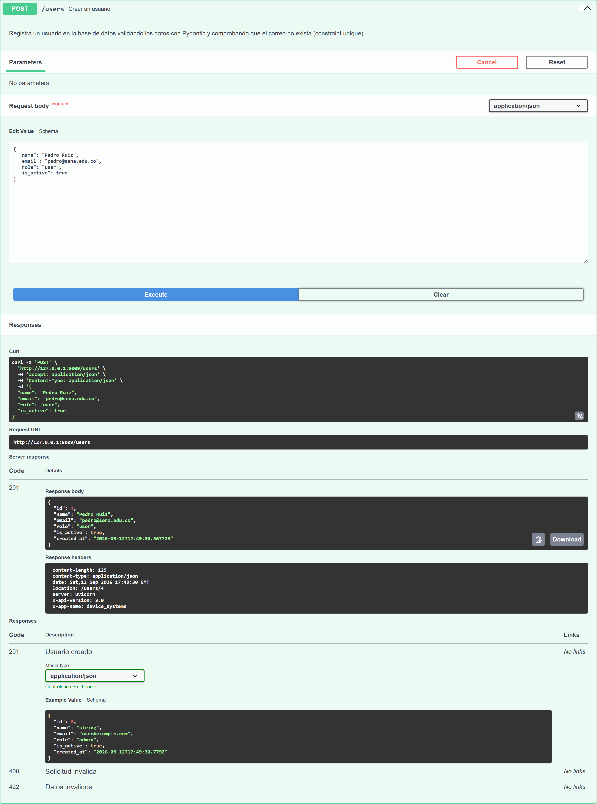

### 4.2 `GET /users` — listar usuarios

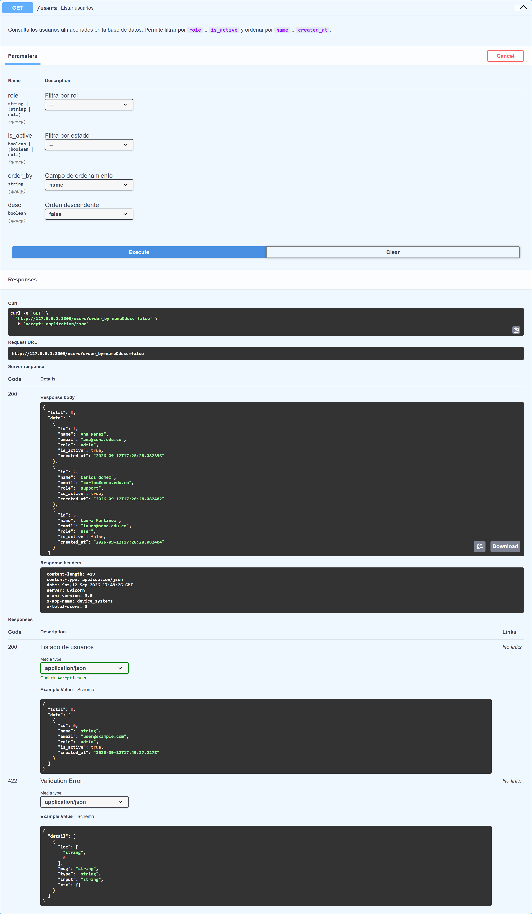

### 4.3 `GET /users/{user_id}` — consultar por ID

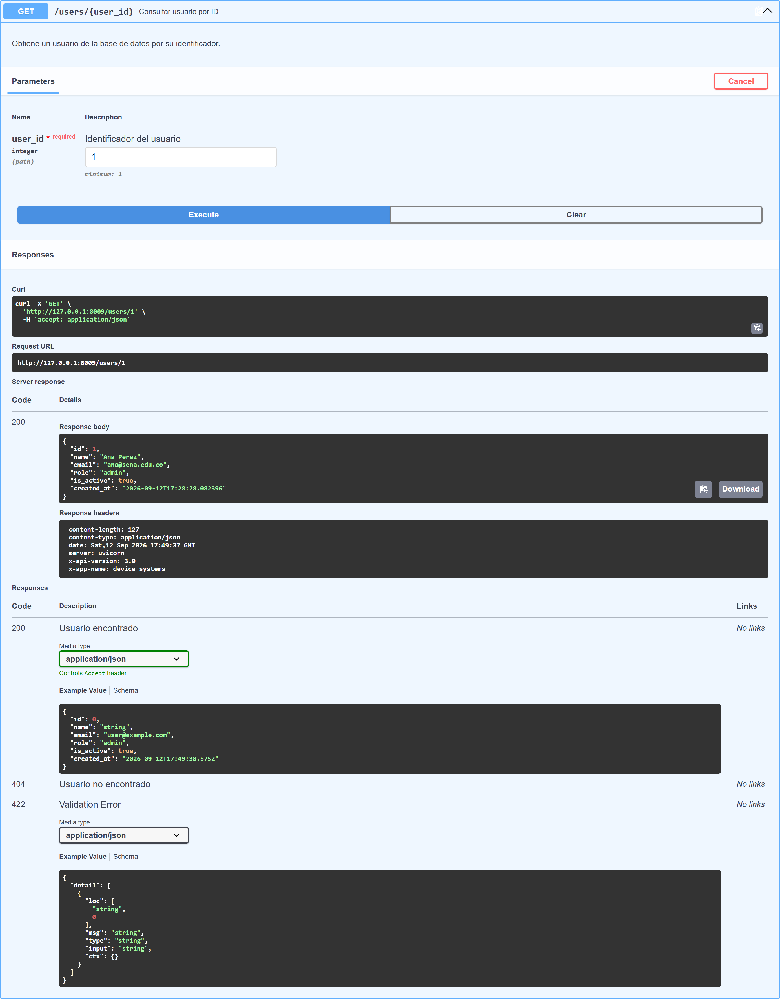

### 4.4 `GET /users?role=admin` — filtrar por rol

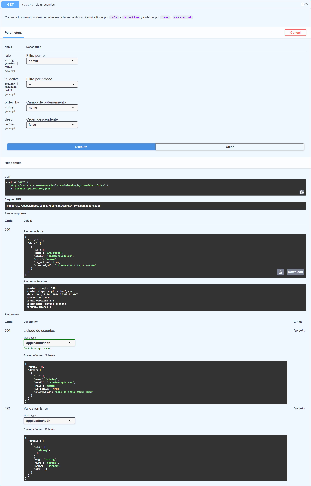

### 4.5 `GET /users?is_active=true` — filtrar por estado

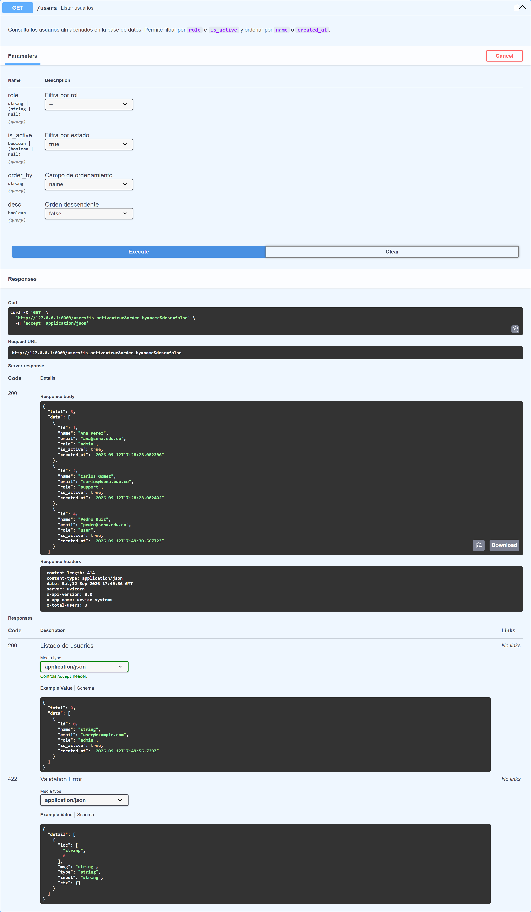

### 4.6 `PUT /users/{user_id}` — actualizacion completa

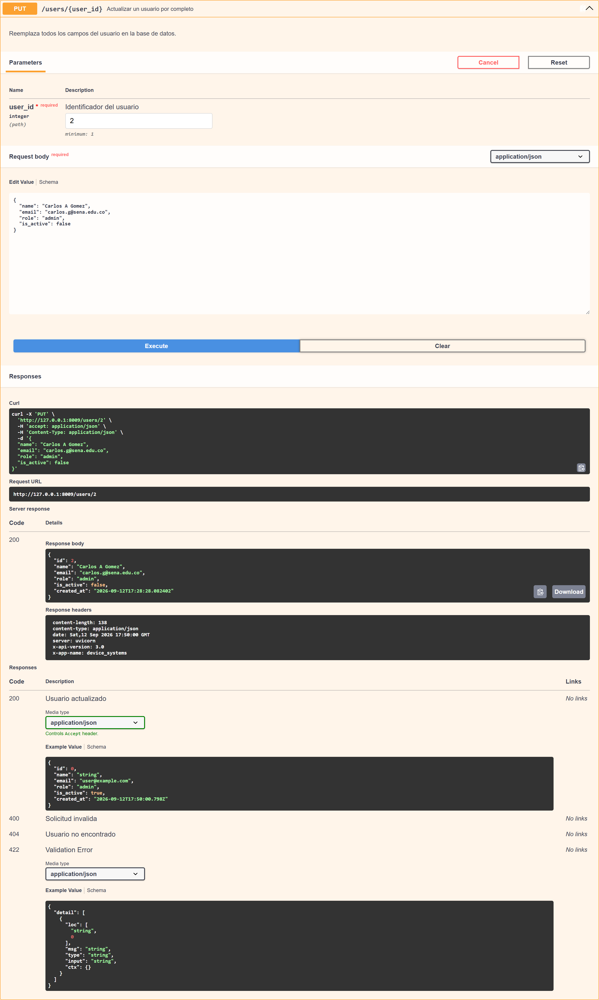

### 4.7 `PATCH /users/{user_id}` — actualizacion parcial

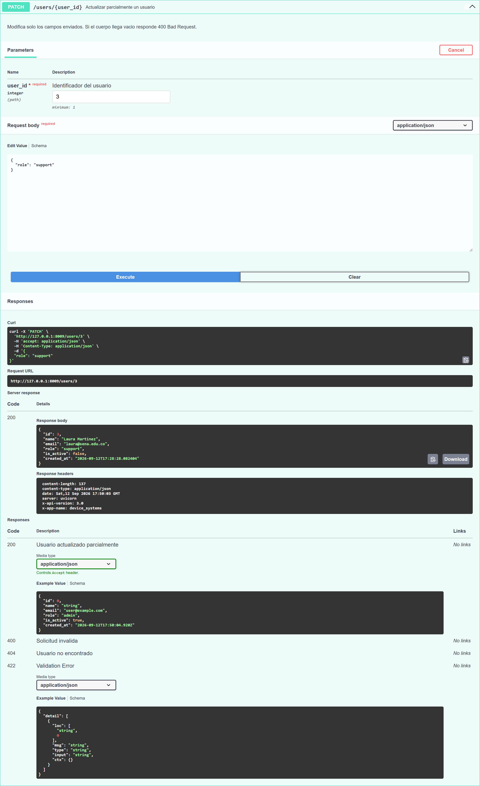

### 4.8 `DELETE /users/{user_id}` — eliminar

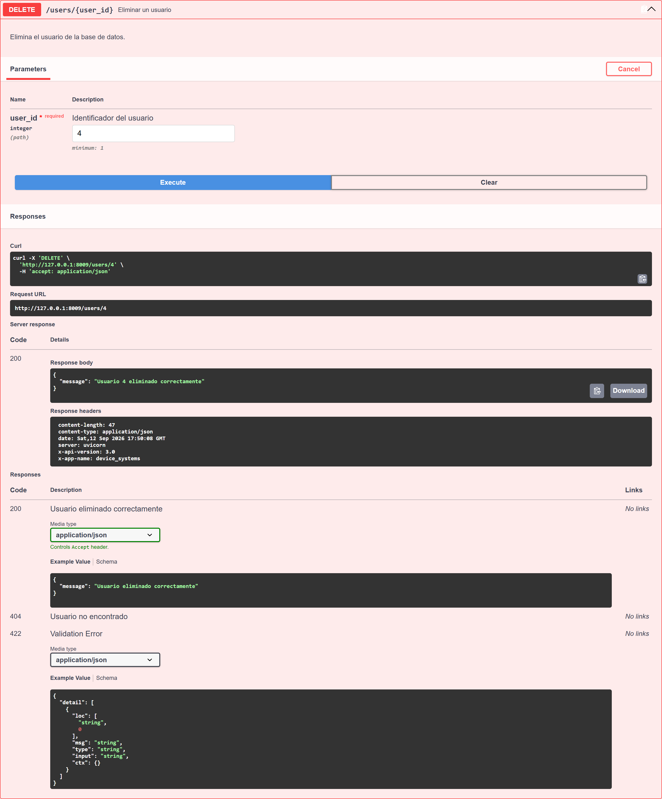

### 4.9 Verificacion: el usuario eliminado ya no existe


## 5. Evidencia de errores controlados

### 5.1 Email duplicado — `400 Bad Request`

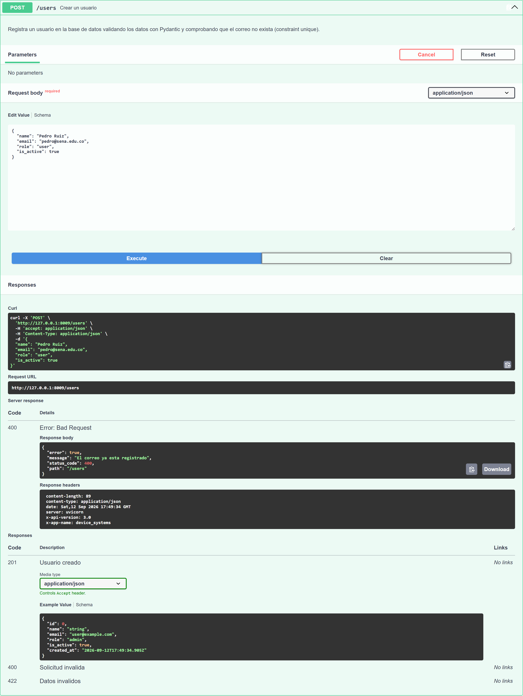

### 5.2 Usuario no encontrado — `404 Not Found`

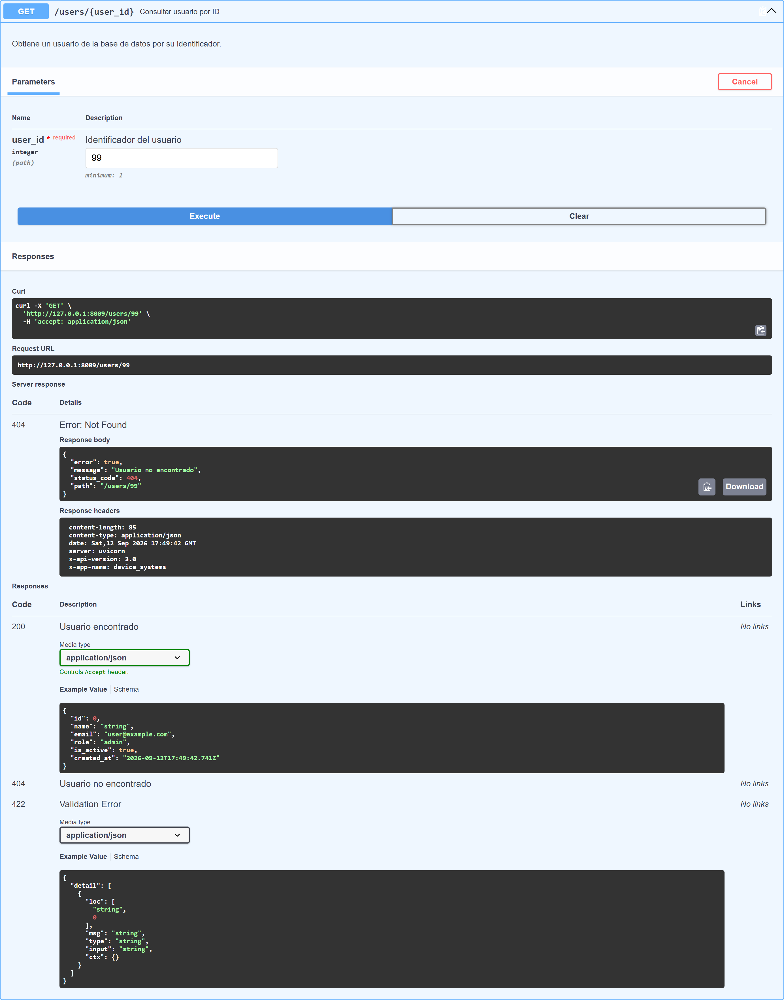

## 6. Diferencia entre modelo SQLAlchemy y schema Pydantic

| | Modelo SQLAlchemy (`User`) | Schema Pydantic (`UserCreate`, `UserResponse`...) |
|---|---|---|
| **Para que sirve** | Representa la **tabla** de la base de datos | Representa el **contrato HTTP** de entrada/salida |
| **Donde vive** | `app/models/user_model.py` | `app/schemas/user_schema.py` |
| **Que declara** | Columnas, tipos SQL, constraints, indices | Campos, tipos Python, validaciones y ejemplos |
| **Quien valida** | El motor de base de datos (`unique`, `nullable`) | Pydantic, antes de llegar a la base de datos |
| **Ejemplo de regla** | `email` con `unique=True` | `email: EmailStr` con formato valido |
| **Si falla** | `IntegrityError` → traducido a `400` | `422 Unprocessable Entity` |

El puente entre ambos es `model_config = ConfigDict(from_attributes=True)`, que permite
construir el schema directamente desde el objeto de la base de datos:

```python
return UserResponse.model_validate(usuario)
```

## 7. Resumen de pruebas

| # | Prueba | Esperado | Resultado |
|---|---|---|---|
| 1 | Crear usuario valido | `201` | OK |
| 2 | Crear usuario con email repetido | `400` | OK |
| 3 | Listar usuarios | `200` | OK |
| 4 | Consultar usuario por ID | `200` | OK |
| 5 | Consultar usuario inexistente | `404` | OK |
| 6 | Filtrar por rol | `200` | OK |
| 7 | Filtrar activos | `200` | OK |
| 8 | Actualizar con `PUT` | `200` | OK |
| 9 | Actualizar con `PATCH` | `200` | OK |
| 10 | Eliminar con `DELETE` | `200` | OK |
| 11 | Validar que el eliminado ya no exista | `404` | OK |

## 8. Reflexion final sobre la importancia de la persistencia

Trabajar con datos en memoria servia para entender los verbos HTTP, pero cualquier
reinicio borraba todo: la API no era utilizable en un escenario real. Al conectar
SQLAlchemy, `device_systems` paso a tener un estado que sobrevive a la aplicacion.

Lo que mas me quedo claro es la separacion entre modelo y schema: el modelo describe
como se guarda la informacion y el schema como se comunica la API con el cliente.
Gracias a `from_attributes=True` convertir uno en otro es directo, y puedo exponer
`created_at` sin que el cliente lo envie nunca.

Tambien entendi el valor de tener dos capas de validacion: Pydantic rechaza los datos
mal formados antes de tocar la base de datos, y los constraints protegen la integridad
aunque el error venga de otro lado; por eso agregue un manejador de `IntegrityError`
que traduce esa violacion a un `400` claro en vez de un error 500.

Finalmente, la dependencia `get_db()` con `yield` me mostro como FastAPI administra
recursos: abre la sesion, la entrega al endpoint y la cierra siempre, incluso si ocurre
una excepcion.
