# Evidencias EV10 — FastAPI Avanzado (Alembic, relaciones y joins)

**Guia:** [Proyecto-Final-v1] GA1-220501096-01-AA1-EV10
**Aprendiz:** Daniel Roman
**Proyecto:** `device_systems` (v4.0.0) — codigo en `../device_systems/`
**Rama:** `device_systems_alembic_relaciones`, unificada con `main`
**Repositorio:** https://github.com/daniel-roman345/python-avanzado-

---

## 1. Migraciones con Alembic

### 1.1 `alembic init alembic`

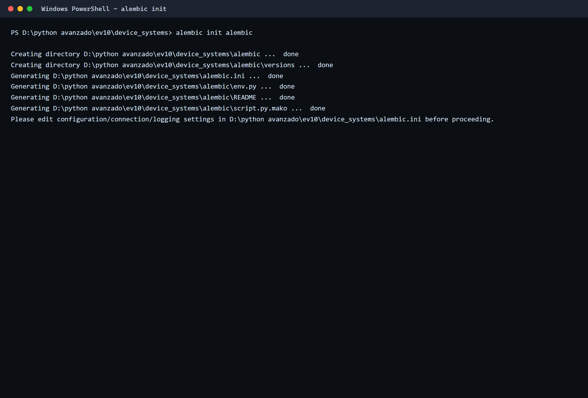

### 1.2 `alembic revision --autogenerate -m "create devices and loans tables"`

Alembic compara los modelos con la base de datos y detecta las tablas `devices` y
`loans` junto con sus indices.

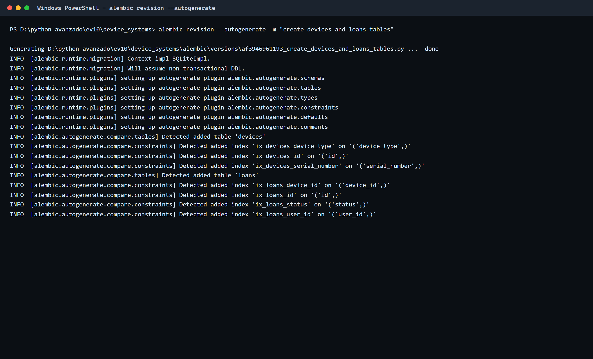

### 1.3 `alembic upgrade head`

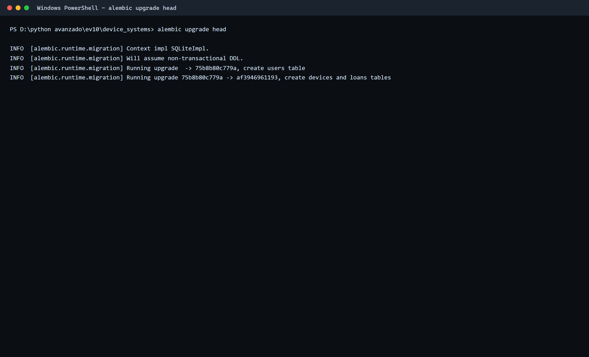

### 1.4 `alembic history` y `alembic current`

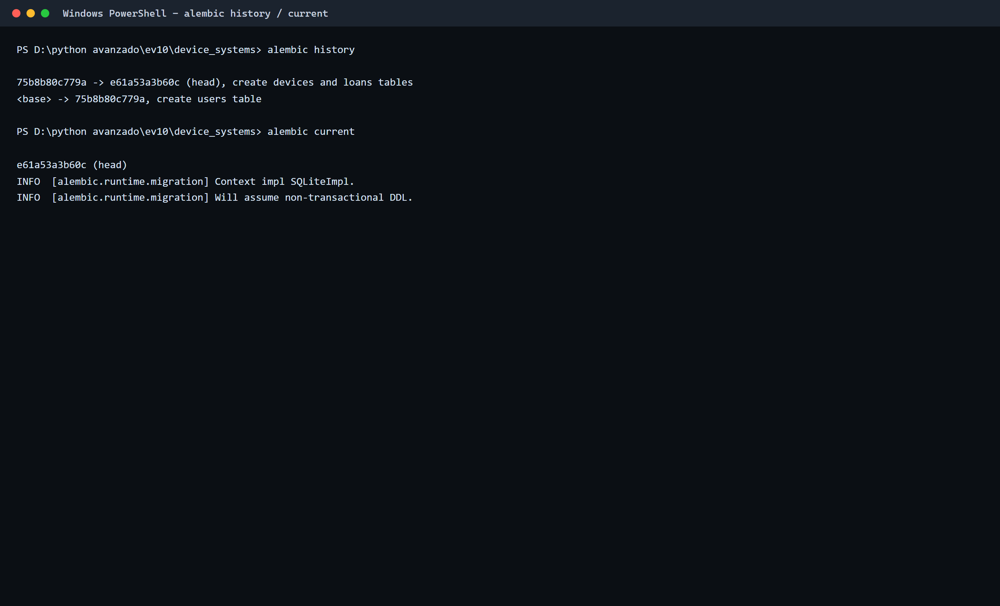

| Revision | Descripcion | Tablas |
|---|---|---|
| `75b8b80c779a` | create users table | `users` |
| `e61a53a3b60c` | create devices and loans tables | `devices`, `loans` |

## 2. Estructura de tablas generadas

Las tres tablas con sus constraints y las claves foraneas de `loans` hacia `users` y
`devices`.

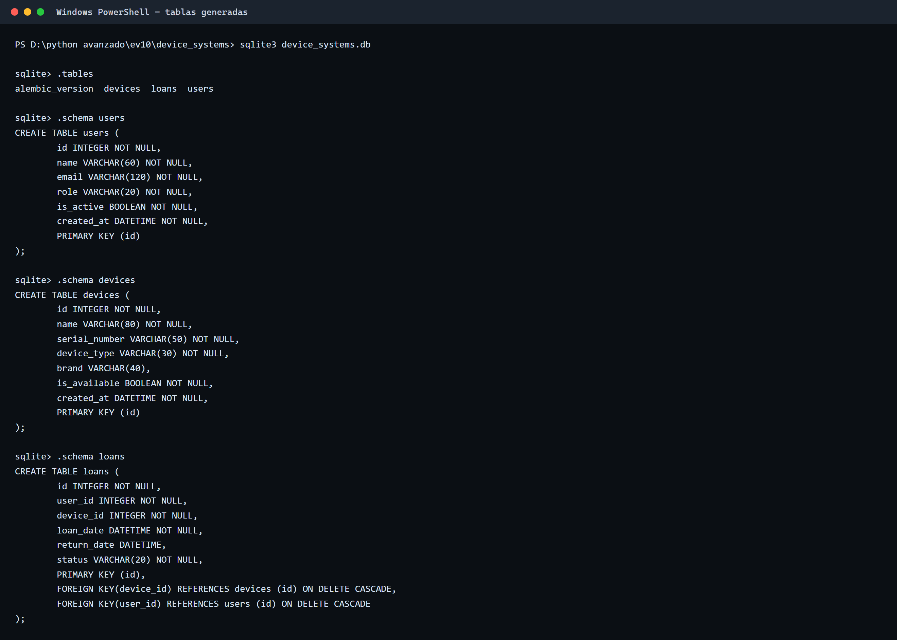

## 3. Capturas de Swagger UI

Documentacion organizada por tags: **Users**, **Devices**, **Loans** y **Root**.

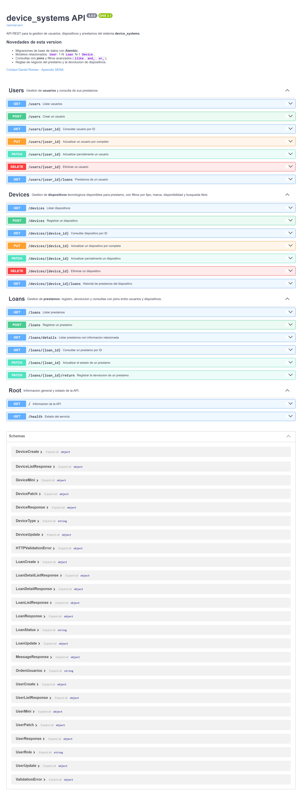

## 4. Evidencia de creacion de usuario, dispositivo y prestamo

### 4.1 Crear usuario — `201`

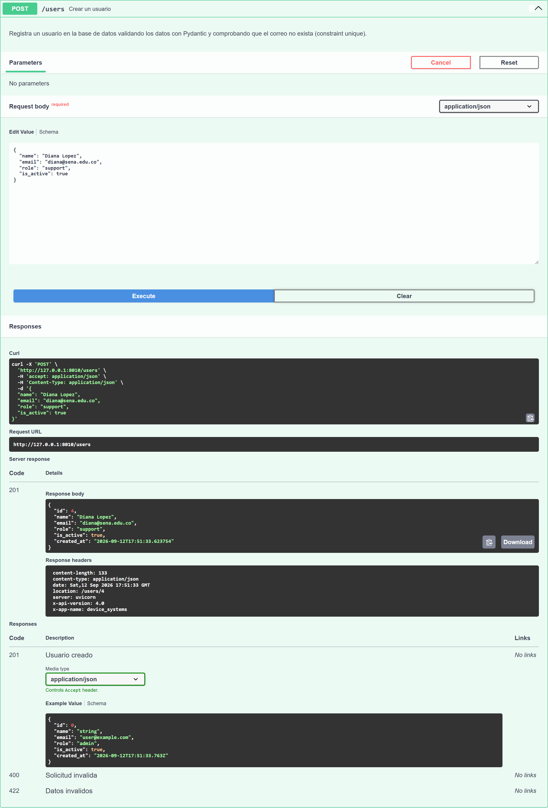

### 4.2 Crear dispositivo — `201`

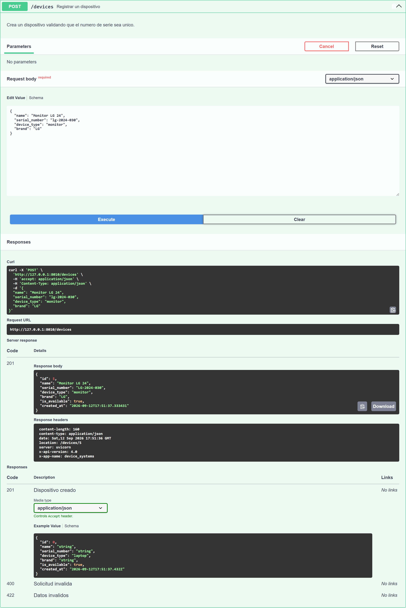

### 4.3 Crear prestamo — `201`

Al crear el prestamo se devuelve la informacion del usuario y del dispositivo, y el
dispositivo pasa a `is_available = false`.

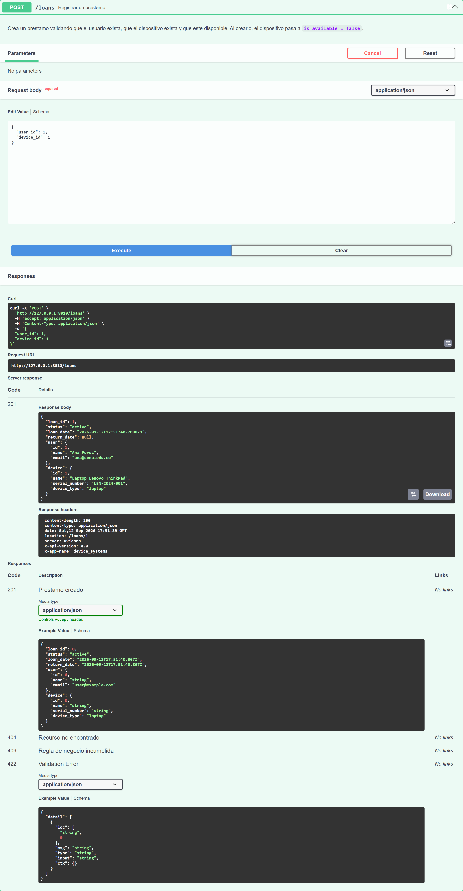

### 4.4 Intento de prestar un dispositivo no disponible — `409 Conflict`

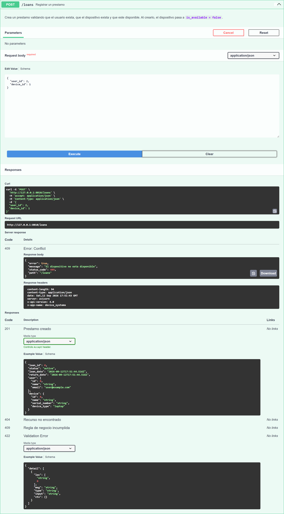

## 5. Evidencia de consultas con joins

### 5.1 `GET /loans/details` — prestamos con usuario y dispositivo

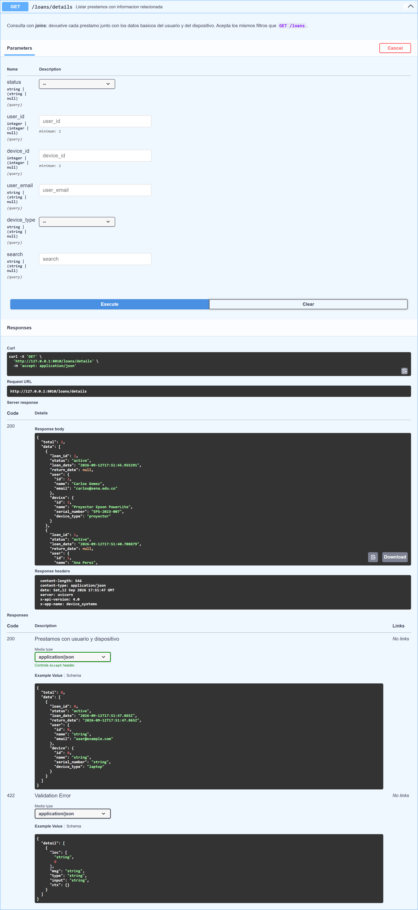

### 5.2 `GET /users/{user_id}/loans` — prestamos de un usuario

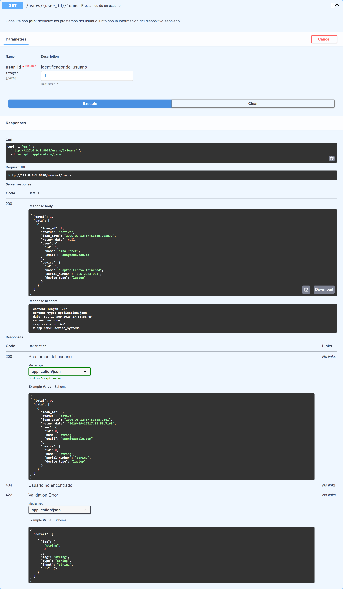

### 5.3 `GET /devices/{device_id}/loans` — historial del dispositivo

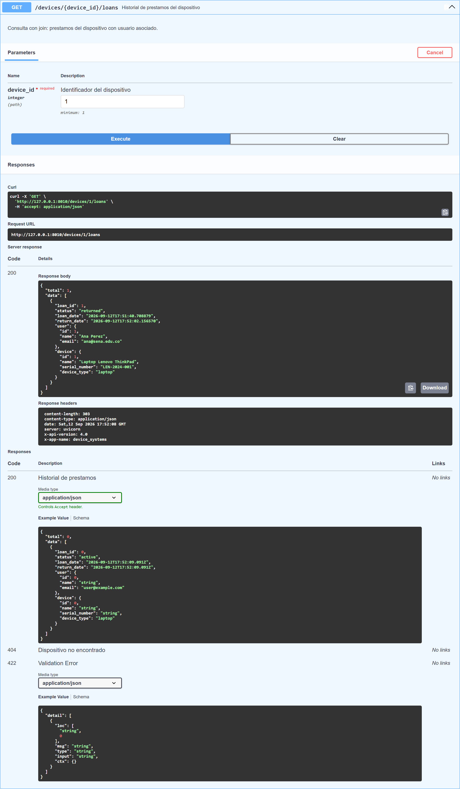

## 6. Evidencia de filtros aplicados

### 6.1 Filtrar por estado — `GET /loans?status=active`

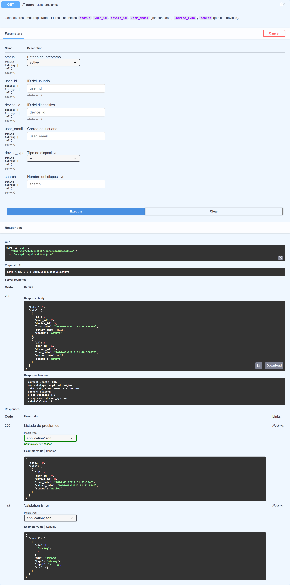

### 6.2 Filtrar por tipo de dispositivo — `GET /loans/details?device_type=laptop`

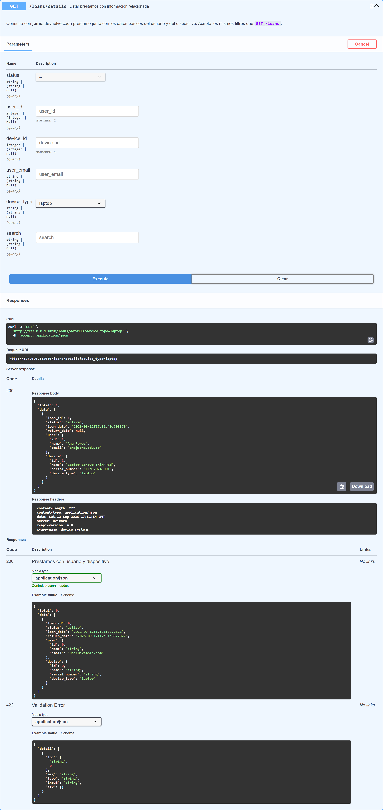

Los filtros se construyen dinamicamente con `join()`, `where()`, `ilike()` y `and_()`:

```python
if user_email is not None:
    consulta = consulta.join(User, Loan.user_id == User.id)
    condiciones.append(User.email.ilike(f"%{user_email}%"))

if condiciones:
    consulta = consulta.where(and_(*condiciones))
```

## 7. Evidencia de devolucion de dispositivo

### 7.1 `PATCH /loans/{loan_id}/return` — `200 OK`

El prestamo queda en `returned` y se asigna `return_date`.

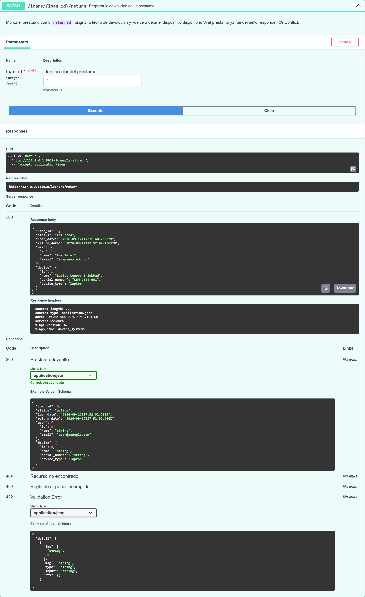

### 7.2 El dispositivo vuelve a estar disponible

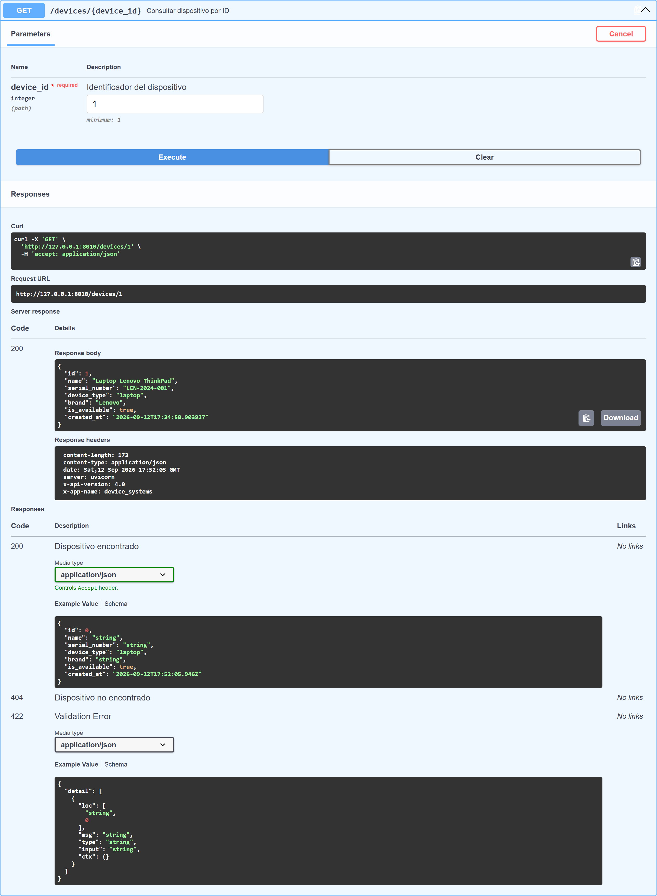

## 8. Relaciones entre modelos

```
users (1) ──────< loans >────── (1) devices
```

```python
# user_model.py / device_model.py
loans: Mapped[List["Loan"]] = relationship("Loan", back_populates="user")
loans: Mapped[List["Loan"]] = relationship("Loan", back_populates="device")

# loan_model.py
user_id:   ForeignKey("users.id")
device_id: ForeignKey("devices.id")
user:   Mapped[User]   = relationship("User", back_populates="loans")
device: Mapped[Device] = relationship("Device", back_populates="loans")
```

## 9. Resumen de pruebas

| # | Prueba | Esperado | Resultado |
|---|---|---|---|
| 1 | Ejecutar migraciones con Alembic | 2 revisiones aplicadas | OK |
| 2 | Crear usuario | `201` | OK |
| 3 | Crear dispositivo | `201` | OK |
| 4 | Crear prestamo | `201` | OK |
| 5 | Prestar un dispositivo no disponible | `409` | OK |
| 6 | Listar prestamos con informacion relacionada | `200` | OK |
| 7 | Filtrar prestamos por estado | `200` | OK |
| 8 | Filtrar prestamos por tipo de dispositivo | `200` | OK |
| 9 | Consultar prestamos de un usuario | `200` | OK |
| 10 | Devolver un dispositivo | `200` | OK |
| 11 | Validar que el dispositivo vuelva a estar disponible | `is_available: true` | OK |
| 12 | Consultar historial de prestamos del dispositivo | `200` | OK |

## 10. Reflexion sobre migraciones, relaciones y consultas avanzadas

Antes de Alembic, cada cambio en los modelos significaba borrar la base de datos y
volver a crearla, lo que en un proyecto real equivale a perder la informacion. Con
Alembic la estructura tiene historia: cada cambio queda en un archivo de `versions/`,
se aplica con `upgrade head` y se revierte con `downgrade`.

Las relaciones cambiaron la forma de pensar los datos. `loans` conecta `users` con
`devices` mediante `ForeignKey`, y las `relationship()` con `back_populates` permiten
navegar en ambos sentidos. La integridad referencial garantiza que nunca exista un
prestamo apuntando a un usuario o dispositivo inexistente.

Las consultas con joins son las que dan valor real a la API: `GET /loans/details`
responde en una sola llamada quien tiene prestado que equipo, y `joinedload()` evita el
problema de las N+1 consultas. Junto con los filtros dinamicos (`ilike`, `and_`, `or_`)
y las reglas de negocio con `409 Conflict`, la API dejo de ser un CRUD y paso a modelar
un proceso real de prestamos.
